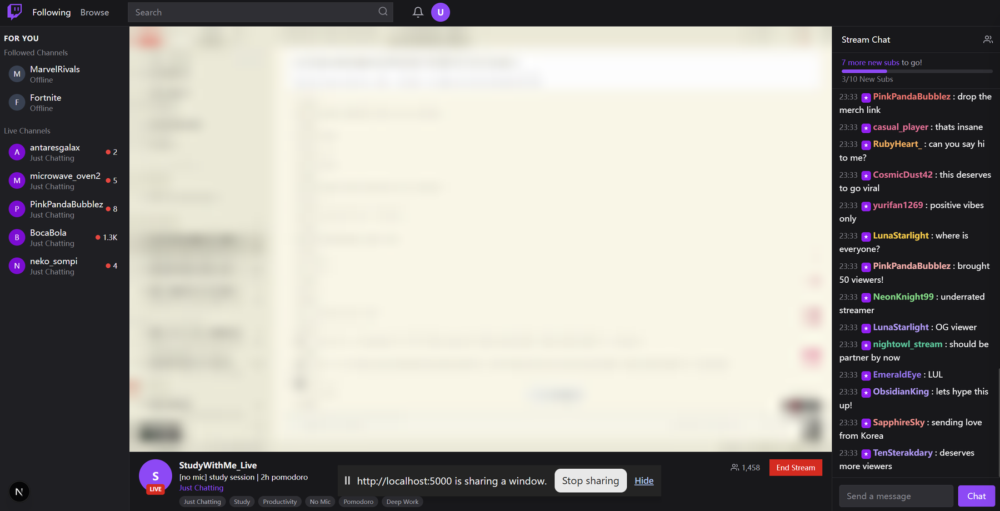
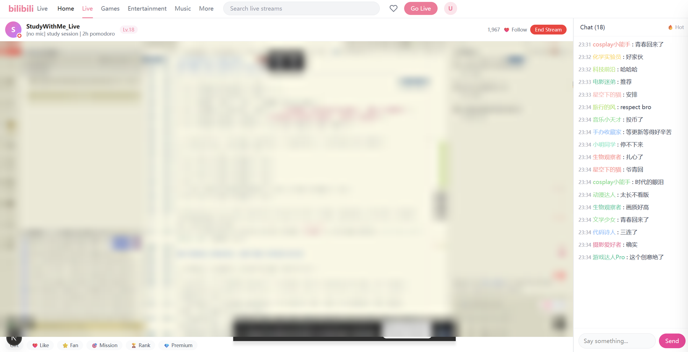

# FakeStream

**A pomodoro focus timer disguised as a live stream.**

Pick a skin, hit **Go Live**, and get to work. Anyone glancing at your screen sees a streamer — sidebar, chat, danmaku, viewer count, a channel page. What's actually running is a 25/5/15 focus timer.

Everything is client-side. No account, no backend, no network traffic.

| Twitch skin | Bilibili skin |
| --- | --- |
|  |  |

> In both shots the screen-share feed is blurred for privacy. The rest is the app as it renders.

## Why

Focus timers fail for a mundane reason: they look like tools, so you fiddle with them instead of working on the thing behind them. A livestream also looks like a tool — but it comes with an audience. FakeStream gives you the audience without the internet: chat scrolling on its own, danmaku drifting past, hearts floating up, gifts landing. Enough ambient motion to feel observed, and nothing to click.

## Features

- **Two skins** — Twitch (dark, `#9146ff`) and Bilibili (light, `#fb7299`), each with its own layout, palette, chat pool and stream copy. Bilibili-only danmaku.
- **Camera and screen share** — real `getUserMedia` / `getDisplayMedia` capture, with a graceful simulated fallback when the browser refuses (see [The HTTPS rule](#the-https-rule)).
- **10 video filters** — drawn through a `<canvas>` so filters apply to live capture, not just to a still.
- **16 emoji stickers** that float over the feed.
- **Simulated audience** — chat auto-scrolls, hearts rise from the bottom, gift toasts slide in, danmaku crosses the frame right-to-left at randomised speeds.
- **Pomodoro** — 25/5/15 minute modes, progress ring, session counter. A compact `mm:ss` chip sits in the corner of the video area, which is the only place the timer is visible.
- **Nothing is exposed as a timer** — by design. The word "pomodoro" never appears in the stream chrome.

## Tech stack

| | |
| --- | --- |
| Framework | Next.js 16 (App Router) + React 19 |
| Language | TypeScript 5 |
| UI | shadcn/ui on Radix primitives, Tailwind CSS v4 |
| Icons | lucide-react |
| Package manager | pnpm 9+ |

## Getting started

Requires Node ≥ 20.9 and pnpm.

```bash
pnpm install
pnpm dev
```

Then open <http://localhost:5000>.

`pnpm dev` shells out to `scripts/dev.sh`, which re-installs dependencies and starts `next dev --webpack` on port 5000. If you'd rather skip the wrapper script:

```bash
pnpm exec next dev --webpack --port 5000
```

## Deployment

### The HTTPS rule

Read this first, it explains most "the camera doesn't work" reports.

`getUserMedia` and `getDisplayMedia` only exist in a [secure context](https://developer.mozilla.org/en-US/docs/Web/API/MediaDevices). `http://localhost` counts. A LAN address does **not** — `http://192.168.1.20:5000` will fail, because at that origin `navigator.mediaDevices` is simply `undefined`.

FakeStream hides that failure rather than throwing an error: it falls back to a simulated placeholder reading *"Camera Active — Demo mode, camera feed simulated."* So the app looks fine over plain HTTP while quietly never touching your camera. Any real deployment therefore needs TLS.

### Vercel

Import the repository — the Next.js preset builds it with no configuration. If you override the build command, use `next build --webpack`; do **not** point it at `pnpm build`, which shells out to the bash scripts the Coze CLI uses.

### Docker

```bash
docker build -t fakestream .
docker run --rm -p 3000:3000 fakestream
```

Then open <http://localhost:3000>. The image is a three-stage Node 22 build (`deps` → `builder` → `runner`) that ends up running `next start`.

### Any Node host or VPS

```bash
pnpm install
pnpm exec next build --webpack
pnpm exec next start --port 3000 --hostname 0.0.0.0
```

Put it behind a TLS-terminating reverse proxy — Caddy, nginx + certbot, Cloudflare Tunnel, Tailscale Serve. Caddy is the least work:

```
stream.example.com {
    reverse_proxy 127.0.0.1:3000
}
```

Without that TLS layer the app still serves, but the camera and screen-share buttons fall back to demo mode.

## Project structure

```
src/
├── app/
│   ├── page.tsx                # skin picker → stream page
│   ├── layout.tsx              # root layout
│   └── globals.css             # Tailwind v4 theme vars + keyframes
├── components/
│   ├── SkinSelector.tsx        # landing screen, picks twitch | bilibili
│   ├── StreamPage.tsx          # shared state: stream mode, filters, stickers, timer
│   ├── TwitchSkin.tsx          # Twitch layout (sidebar, chat, channel bar)
│   ├── BilibiliSkin.tsx        # Bilibili layout (header, danmaku, like bar)
│   ├── VideoFeed.tsx           # camera / screen capture + canvas filters
│   ├── ChatPanel.tsx           # scrolling chat
│   ├── DanmakuOverlay.tsx      # right-to-left bullet comments
│   ├── LikesOverlay.tsx        # rising hearts
│   ├── GiftOverlay.tsx         # gift toasts
│   ├── FilterPanel.tsx         # filter + sticker controls
│   ├── PomodoroTimer.tsx       # the actual timer, in the slide-out drawer
│   └── ui/                     # shadcn/ui primitives
├── hooks/
│   ├── usePomodoro.ts          # 25/5/15 state machine
│   ├── useSimulatedChat.ts     # message queue
│   ├── useSimulatedDanmaku.ts  # danmaku queue
│   ├── useSimulatedLikes.ts    # heart spawner
│   └── useSimulatedGifts.ts    # gift spawner
└── lib/
    └── simulatedData.ts        # every username, message, gift, filter and sticker
```

## Notes and gotchas

- **The first click on the stream page goes nowhere.** The control drawer (filters, stickers, timer) opens automatically when you pick a skin, and its full-screen backdrop intercepts pointer events — so the first click anywhere just closes the drawer. Click once, then use *Go Live* / *Share Screen*.
- **Stopping a screen share from the browser's own "Stop sharing" bar** is handled: the feed resets to idle instead of freezing on the last frame.
- **Stream state persists while the camera is off.** The chat, danmaku and likes only start once you go live, but the timer keeps counting either way.
- **Browser support.** Chrome, Edge and Firefox are fine. Safari supports `getDisplayMedia` from 15.4 with a different picker; behaviour there is untested.
- **All audience activity is fake.** Every username and message lives in `src/lib/simulatedData.ts`. Nothing is sent anywhere.

## Credits

Built on a [Coze](https://www.coze.com/) Next.js + shadcn/ui starter, which supplies `scripts/` and the `.coze` manifest. The scripts are optional — plain `pnpm exec next …` works without them.

Twitch and Bilibili are referenced only as visual styles. This project is unaffiliated with both.

## License

MIT — see [LICENSE](LICENSE).
